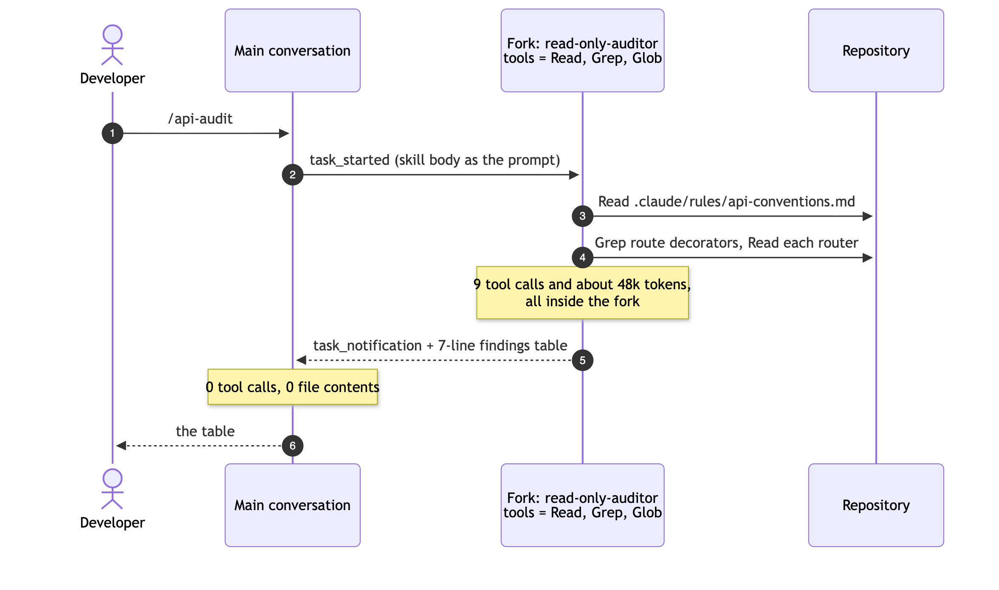
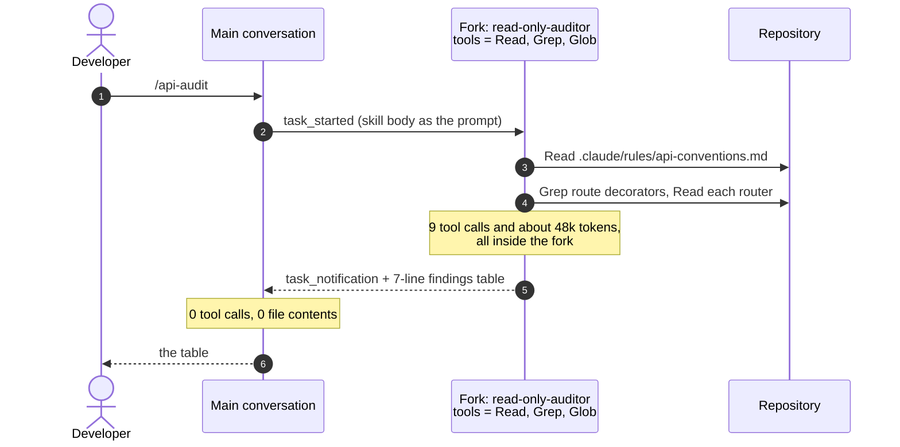

# Verification Playbook

A hands-on guide to proving that each piece of the team setup does what the design says. For
each check you get the command to run, what to look for, a sample run, and how the automated test
grades it.

> Architecture and design: [README.md](README.md). Project brief: [PROJECT.md](PROJECT.md).

---

## Contents

- [Before you start](#before-you-start)
- [Quick reference](#quick-reference)
- [How to read the instructions log](#how-to-read-the-instructions-log)
- [Check 1: Every teammate gets the same project instructions](#check-1-every-teammate-gets-the-same-project-instructions)
- [Check 2: Rules load only for matching files](#check-2-rules-load-only-for-matching-files)
- [Check 3: The forked skill runs in isolation](#check-3-the-forked-skill-runs-in-isolation)
- [Check 4: Shared and personal MCP servers side by side](#check-4-shared-and-personal-mcp-servers-side-by-side)
- [Check 5: Plan mode versus direct execution](#check-5-plan-mode-versus-direct-execution)
- [Everyday use of the slash commands](#everyday-use-of-the-slash-commands)
- [Troubleshooting](#troubleshooting)

---

## Before you start

Run every command from the project folder (the one that contains `pyproject.toml`).

```bash
uv sync                                  # install dependencies (first time only)
cp .env.example .env                     # the demo tracker accepts the placeholder token
set -a; source .env; set +a              # export TRACKER_TOKEN into this shell
claude                                   # once: accept the trust dialog, then /exit
```

The last step matters. Until you trust the folder, Claude Code still reads `CLAUDE.md`, but it
**ignores the project's permissions, hooks, and MCP approvals**. That's a safety boundary: a repo
you just cloned can't grant itself anything. Headless runs print this when the folder isn't
trusted yet:

```text
Ignoring 9 permissions.allow entries from .claude/settings.json: this workspace has not been
trusted. Run Claude Code interactively here once and accept the trust dialog ...
```

Checks 1 to 4 are automated as live tests (`uv run pytest -m live`). They drive the real
`claude` CLI headlessly, use Haiku by default (`CLAUDE_LIVE_MODEL` overrides it), and cost a few
cents in total. Check 5 uses Sonnet and costs roughly $0.10 to $1.50 per trial.

---

## Quick reference

| # | What it proves | Command | Automated test |
|---|---|---|---|
| 1 | Project instructions reach every developer and every session | `claude -p "What commit message format do we use?"` | `test_project_instructions_load_at_start_and_rules_do_not` |
| 2 | A rule loads only when Claude touches a matching file | `claude -p "Read src/taskboard/api/routes/tasks.py ..."`, then read the log | `test_path_scoped_rule_loads_only_for_matching_file` (4 cases), `test_subdirectory_claude_md_loads_when_its_folder_is_touched` |
| 3 | `/api-audit` runs in a read-only fork and returns only its report | `claude -p "/api-audit" --output-format stream-json --verbose` | `test_forked_skill_runs_in_isolation_with_read_only_tools` |
| 4 | `team-tracker` (project) and `sandbox-time` (user) are both connected | `claude mcp list` | `test_project_mcp_server_receives_token_from_environment`, `test_project_and_personal_mcp_servers_are_both_available` |
| 5 | When plan mode pays for itself | `uv run python scripts/plan_vs_direct.py TB-102 plan` | Manual: compare the JSON summaries |

Run the whole live suite:

```bash
uv run pytest -m live -v
```

---

## How to read the instructions log

`.claude/settings.json` registers an `InstructionsLoaded` hook. Every time Claude Code loads a
`CLAUDE.md` or a rules file, the hook appends one line to `.claude/logs/instructions-loaded.jsonl`
(git-ignored). Print it compactly:

```bash
python3 -c "
import json
for line in open('.claude/logs/instructions-loaded.jsonl'):
    r = json.loads(line)
    print(r['session_id'][:8], r['load_reason'].ljust(16), r['file'].ljust(38), r['trigger_file'] or '')
"
```

| `load_reason` | Meaning |
|---|---|
| `session_start` | Loaded when the session began: `CLAUDE.md`, `CLAUDE.local.md`, `~/.claude/CLAUDE.md`, and any rule **without** `paths` |
| `path_glob_match` | A path-scoped rule whose glob matched a file Claude just touched. `trigger_file` names that file. |
| `nested_traversal` | A `CLAUDE.md` in a subdirectory, loaded when Claude first works inside that directory |
| `include` | A file pulled in by an `@path` import |
| `compact` | Re-loaded after the conversation was compacted |

---

## Check 1: Every teammate gets the same project instructions

**What it shows:** the committed `CLAUDE.md` loads in every session on every machine, including
a fresh clone that has no personal files and hasn't been trusted yet.

```bash
claude -p "Answer from your loaded project instructions only, without tools, in three short lines: \
1) the required commit message format, 2) how known bugs are pinned in tests, 3) when to use plan mode."
```

**Sample run** (2026-09-29, Haiku, in a fresh copy of the repo with no `CLAUDE.local.md`, never
trusted):

```text
1. Commit message format: `TB-123: imperative summary` (issue ID, colon, action-oriented summary)
2. Known bugs in tests: Use `@pytest.mark.xfail(strict=True, reason="TB-###: ...")` — the strict
   flag fails the suite if the marker is forgotten after the fix is applied
3. When to use plan mode: Use it when a change touches more than three files, migrates a library,
   or when the issue lists open design questions; execute directly for a well-specified
   single-file fix
```

**What to look for in the log:** every session starts with `CLAUDE.md` (`memory_type: Project`)
and, on machines that have one, `CLAUDE.local.md` (`memory_type: Local`). No `.claude/rules/`
file appears at `session_start`.

**Why it's consistent for everyone:** `check-claude-config` fails the build if `CLAUDE.md` is
ever git-ignored or if `CLAUDE.local.md` isn't. The team layer can't silently go missing, and a
personal layer can't leak into the repo.

---

## Check 2: Rules load only for matching files

**What it shows:** each file in `.claude/rules/` has a `paths:` glob in its frontmatter and stays
out of context until Claude touches a matching file.

```bash
check() { claude -p "Use the Read tool to read \`$1\`, then reply with only its number of lines. Do not read any other file." --model haiku > /dev/null; }
check src/taskboard/api/routes/tasks.py
check tests/test_models.py
check src/taskboard/models.py
check README.md
check src/team_tracker/server.py
```

Before running Claude, you can ask the config linter what *should* load:

```bash
uv run check-claude-config rules-for src/taskboard/api/routes/tasks.py tests/test_models.py README.md
```

```text
src/taskboard/api/routes/tasks.py
  -> .claude/rules/api-conventions.md  (matches src/taskboard/api/**/*.py)
tests/test_models.py
  -> .claude/rules/testing-conventions.md  (matches tests/**/*.py, **/test_*.py, **/conftest.py)
README.md
  (no rules: only CLAUDE.md applies)
```

**Sample log** (2026-09-29; one session per file, `session_start` lines trimmed):

```text
d839f185 path_glob_match  .claude/rules/api-conventions.md       src/taskboard/api/routes/tasks.py
d80227f0 path_glob_match  .claude/rules/testing-conventions.md   tests/test_models.py
b685ccad path_glob_match  .claude/rules/domain-models.md         src/taskboard/models.py
f5719d98                  (nothing beyond CLAUDE.md)             README.md
b799d53c nested_traversal src/team_tracker/CLAUDE.md             src/team_tracker/server.py
```

Each session loaded **exactly one** rule, the one whose glob matches the file it read, and the
`README.md` session loaded none. The last line shows the other lazy mechanism: a `CLAUDE.md` in a
subdirectory loads when Claude first works in that folder.

**Graded checks:** for each of the four files, the set of `path_glob_match` rules equals the
expected rule (or is empty for `README.md`), and each was triggered by that file.

---

## Check 3: The forked skill runs in isolation

**What it shows:** `/api-audit` (`context: fork`) runs in a separate agent. That agent reads and
searches the API layer, and the main conversation receives only the final findings table.

```bash
claude -p "/api-audit" --output-format stream-json --verbose > audit.jsonl
```

**Expected sequence:**



<details>
<summary>Diagram source (Mermaid)</summary>



</details>

**Sample run** (2026-09-29, Haiku):

```text
fork agent: read-only-auditor
MAIN tool calls: 0
FORK tool calls: ['Read', 'Grep', 'Read', 'Read', 'Read', 'Grep', 'Read', 'Glob', 'Read']

API audit: 6 endpoints checked, 3 findings
| # | Severity | Endpoint       | File:line    | Rule broken                                      | Fix |
| 1 | medium   | GET /{task_id} | tasks.py:31  | Missing return type annotation                   | Add `-> Task` |
| 2 | high     | GET /{task_id} | tasks.py:32-35 | try/except around service call; {"detail": ...} instead of the envelope | Let TaskNotFound propagate |
| 3 | high     | DELETE /{task_id} | tasks.py:45 | No status_code=204; returns {"deleted": True} | status_code=204, response_class=Response |
```

Both violations planted in `src/taskboard/api/routes/tasks.py` were found. The fork's transcript
is written to `~/.claude/projects/<project>/<session>/subagents/`. The main session's transcript
contains no tool calls and no file contents.

**A finding worth knowing:** the first version of this skill used `agent: Explore`, and its fork
still ran `Bash(find ...)`, although `allowed-tools` listed only `Read, Grep, Glob`.
`allowed-tools` **pre-approves** tools; it doesn't remove the others. The real restriction comes
from the agent the skill forks into. `.claude/agents/read-only-auditor.md` declares
`tools: Read, Grep, Glob`, and with it the fork used exactly those three tools. `check-claude-config`
now warns when a forked skill uses a built-in agent.

**Graded checks:** the fork's agent is `read-only-auditor` · the main conversation made no tool
calls · every fork tool call is `Read`, `Grep`, or `Glob` · the report starts with `API audit:` and
cites `tasks.py`.

---

## Check 4: Shared and personal MCP servers side by side

**What it shows:** the team's `team-tracker` server comes from `.mcp.json` with its token expanded
from your environment, a personal `sandbox-time` server comes from `~/.claude.json`, and Claude
Code connects to both at once.

```bash
scripts/personal-mcp.sh add                 # claude mcp add --scope user sandbox-time -- uvx mcp-server-time
claude mcp list
```

**Sample run** (2026-09-29):

```text
sandbox-time: uvx mcp-server-time - ✔ Connected
team-tracker: uv run --quiet --directory ${CLAUDE_PROJECT_DIR} team-tracker-mcp - ✔ Connected
```

`claude mcp get team-tracker` shows `Scope: Project config (shared via .mcp.json)`. The user-scope
entry sits at the top level of `~/.claude.json`, so it follows you into every project and never
reaches the repo:

```json
"mcpServers": { "sandbox-time": { "type": "stdio", "command": "uvx", "args": ["mcp-server-time"], "env": {} } }
```

**Prove the token really comes from your shell:** the live test generates a random token for each
run and asks Claude for the `whoami` fingerprint. The server only reports the last four
characters, so the test passes only if the random value made it through `${TRACKER_TOKEN}`:

```text
{ "authenticated": true, "project_key": "TB", "token_fingerprint": "tt_…1234", "problem": null }
```

**What happens without the token:** Claude Code still starts the server, and `claude mcp list`
prints a diagnostic instead of failing:

```text
[Warning] [team-tracker] mcpServers.team-tracker: Missing environment variables: TRACKER_TOKEN
```

The server then answers every call with an `UNAUTHORIZED` tool error that explains how to fix it.
`uv run check-claude-config mcp-env` shows the same thing before you start `claude`.

Remove the personal server with `scripts/personal-mcp.sh remove`.

---

## Check 5: Plan mode versus direct execution

**What it shows:** how the same request plays out in plan mode and in direct execution, on the
three kinds of task from the brief:

| Issue | Kind | Why it was chosen |
|---|---|---|
| TB-101 | Single-file bug | `start = page * page_size` in `services/tasks.py`; one line, pinned by a strict `xfail` |
| TB-102 | Multi-file library migration | Pydantic v1 idioms spread over models, storage, services, and tests; the acceptance gate is `-W error::DeprecationWarning` |
| TB-103 | Feature with several valid designs | Rate limiting, with four open questions in the issue: algorithm, placement, key, state |

**Run a trial:**

```bash
uv run python scripts/plan_vs_direct.py TB-101 direct
uv run python scripts/plan_vs_direct.py TB-102 direct-forced
uv run python scripts/plan_vs_direct.py TB-103 plan --model sonnet
```

Each trial copies the repo to a temp folder (with its own git baseline, so the seeded issues stay
unfixed here), runs Claude Code headlessly, then runs the tests and prints a JSON summary:

```json
{
  "issue": "TB-102", "mode": "direct-forced", "model": "sonnet",
  "turns": 27, "cost_usd": 0.4645, "wall_seconds": 122,
  "tests": "65 passed, 9 deselected, 1 xfailed in 1.46s",
  "passes_with_deprecations_as_errors": true,
  "files_changed": ["src/taskboard/models.py", "src/taskboard/services/tasks.py", "..."],
  "xfail_marker_left": false
}
```

| Mode | What the runner does |
|---|---|
| `direct` | Sends the request with `--permission-mode acceptEdits`. Team rules apply, including the "use plan mode when ..." rule in `CLAUDE.md`. |
| `direct-forced` | The same, plus "do not stop to ask or to recommend plan mode". This shows what direct execution produces on its own. |
| `plan` | Sends the request with `--permission-mode plan`, saves the plan, then resumes the session with "The plan is approved. Implement it now." |

> **Plan mode in headless runs.** With `-p`, Claude Code can't show the approval dialog, so
> `ExitPlanMode` is disabled. Claude writes the plan to `~/.claude/plans/<name>.md` and ends the
> turn. Resuming the session (`--resume <session_id>`) with an approval message plays the part of
> the human saying yes. The runner saves each plan next to its trial folder as `<folder>.plan.md`.

**Results** (2026-09-29, Sonnet):

| Issue | Mode | Outcome | Turns | Time | Cost | Files | Tests after |
|---|---|---|---|---|---|---|---|
| TB-101 | direct | Fixed | 15 | 46 s | $0.26 | 2 | 65 pass |
| TB-101 | plan → execute | Same fix | 19 | 141 s | $0.55 | 2 | 65 pass |
| TB-102 | direct | Stopped, recommended plan mode | 7 | 27 s | $0.14 | 0 | unchanged |
| TB-102 | direct, forced | Migrated, strict gate passes | 27 | 122 s | $0.46 | 6 | 65 pass |
| TB-102 | plan → execute | Migrated, strict gate passes | 27 | 244 s | $0.93 | 6 | 65 pass |
| TB-103 | direct | Stopped, proposed answers, asked | 5 | 33 s | $0.13 | 0 | unchanged |
| TB-103 | direct, forced | Built, decisions reported afterwards | 28 | 201 s | $0.63 | 6 | 72 pass (+8) |
| TB-103 | plan → execute | Built, decisions reviewed first | 34 | 369 s | $1.30 | 6 | 76 pass (+12) |

### TB-101: the plan restates the fix

The plan (6 turns) found the root cause and proposed the same one-line change the direct run made
without planning:

```text
- Root cause: `TaskService.list` in `src/taskboard/services/tasks.py:42` computes
  `start = page * page_size`, treating `page` as 0-indexed, but the API is 1-indexed.
- Fix: change to `start = (page - 1) * page_size`.
- Remove the `xfail(strict=True, reason="TB-101: ...")` marker from
  `test_first_page_returns_first_tasks`.
```

**Verdict:** no value. Go direct.

### TB-102: the team rule applies the brakes

Without being forced, the direct run read the issue and stopped:

```text
TB-102 is a Pydantic v1→v2 migration that the issue itself describes as spanning models, storage,
services, and tests — and per both the project's `CLAUDE.md` and the `fix-issue` skill,
migrations like this (touching more than three files, or migrating a library) require plan mode
rather than direct execution.

I'll stop here rather than edit code. Please re-run this with plan mode enabled (Shift+Tab) ...
```

The plan it would have wanted is a file-by-file inventory with an order of operations:

```text
### 2. Call-site migrations (mechanical renames, no behavior change)
- src/taskboard/storage/repository.py:15 — `**data.dict()` → `**data.model_dump()`
- src/taskboard/storage/repository.py:29 — `current.copy(update={...})` → `current.model_copy(update={...})`
- src/taskboard/services/tasks.py:52 — `changes.dict(exclude_unset=True)` → `changes.model_dump(exclude_unset=True)`
- tests/conftest.py:36 — `TaskCreate.parse_obj({...})` → `TaskCreate.model_validate({...})`
...
## Order of operations
4. Remove the `xfail` marker in tests/test_migration_readiness.py last, so it acts as the final gate.
```

Forced to go direct, Claude produced an equivalent migration of the same six files, for half the
cost. The one real difference is in the model validator: the direct run checks
`self.__dict__.values()`, while the planned run lists the six fields by hand, which will go stale
when a field is added.

**Verdict:** the plan is a review checkpoint, not a quality gain, when a rule file prescribes the
idioms and a test enforces the outcome.

### TB-103: the plan surfaces the decisions

The planned run spent 18 of its 34 turns planning. It answered each open question with a reason
tied to this codebase:

```text
1. Algorithm: fixed window counter. The acceptance criteria explicitly call for testable
   "window-reset behaviour"; a fixed window gives one crisp, clock-injectable transition ...
2. Placement: a FastAPI dependency on the three write routes only, not middleware and not the
   service layer. Middleware would need method/path matching to exempt GETs ... The service layer
   is out per .claude/rules/domain-models.md ...
3. Key: X-Client-Id header, falling back to client IP ... The prefix stops a spoofed X-Client-Id
   from colliding with someone's IP-derived key.
4. State: plain in-memory class, no formal interface. Mirrors the TaskRepository precedent ...
   Introducing a Protocol now, with one caller and one implementation, is unrequested abstraction.
```

The forced direct run reached the same answers for 1 to 3, but went the other way on 4: it added
a `RateLimiter` `Protocol` "so a Redis-backed implementation can drop in later". Both are
defensible. The difference is **when a human gets to choose**: before any code in plan mode, or
after six files have changed in direct mode.

**Verdict:** the most value. Use plan mode whenever the issue itself lists open questions.

### What to look for when you run it yourself

- `files_changed` and `tests` should match the table's shape (exact test counts depend on how
  many tests Claude writes for TB-103).
- For TB-102, `passes_with_deprecations_as_errors` must be `true`, and `xfail_marker_left` must be
  `false`.
- Read the saved `.plan.md` next to the trial folder and ask: which of these decisions would I
  have made differently? That's the value of plan mode, and it's zero when the answer is always
  "none".
- Live runs vary: Claude may write different tests or word its plan differently. Compare
  behaviour, not text.

---

## Everyday use of the slash commands

| Command | When to use it | What it does |
|---|---|---|
| `/fix-issue TB-101` | A tracked bug you expect to be small | Reads the issue over MCP, **sizes it first** (stops and recommends plan mode if it's big), reproduces it with a test, fixes it, runs the suite, drafts the commit message |
| `/new-endpoint POST /v1/tasks/{id}/comments add a comment` | Adding an endpoint | Walks service → route → tests in the team's layering, and restates the contract before writing code |
| `/pre-pr` | Before opening a pull request | Injects `git status` and `git diff --stat` into the prompt, runs tests and lint, and reports PASS/FAIL against the team's checklist |
| `/api-audit [dir]` | Reviewing the API layer | Runs the read-only forked audit from Check 3 |

The sizing gate in `/fix-issue` is worth seeing once. Handed the migration:

```bash
claude -p "/fix-issue TB-102" --permission-mode acceptEdits
```

```text
This is explicitly labeled a migration issue ... and spans models, storage, services, and tests
(more than three files). Per the sizing rule, I'm stopping here rather than editing anything.

Recommendation: Re-run this with plan mode (Shift+Tab) so we can scope the migration properly ...
```

Four turns, about $0.11, and no files touched.

---

## Troubleshooting

| Symptom | Fix |
|---|---|
| `Ignoring N permissions.allow entries ... this workspace has not been trusted` | Run `claude` once in the folder and accept the trust dialog. Until then the project's permissions, hooks, and MCP approvals don't apply. |
| `team-tracker ... ⏸ Pending approval` | Same cause: the folder isn't trusted yet. After trust, `enabledMcpjsonServers` in `.claude/settings.json` approves it. |
| `Missing environment variables: TRACKER_TOKEN` | Export it in the shell that starts `claude`: `set -a; source .env; set +a`. Claude Code doesn't read `.env` itself. |
| `whoami` reports `arrived unexpanded as '${TRACKER_TOKEN}'` | The variable wasn't set when the session started. Export it and restart `claude`. |
| No `.claude/logs/instructions-loaded.jsonl` | The folder isn't trusted (hooks are ignored), or `python3` isn't on your `PATH`. The hook works on Python 3.8 and later. |
| A rule loads when you didn't expect it | `uv run check-claude-config rules-for <file>` shows which glob matched. |
| Live test `..._both_available` is skipped | Register the personal server first: `scripts/personal-mcp.sh add`. |
