# Claude Code for Software Development


A team-ready Claude Code setup on a real FastAPI codebase, **verified live against the Claude Code
CLI**. Every developer who clones the repo gets the same instructions. Conventions load only
where they apply. A code audit runs in a sealed, read-only fork. Shared and personal MCP servers
run side by side. The question "plan mode or just do it?" is answered with measurements.

> Project brief (objective and tasks): [PROJECT.md](PROJECT.md) ·
> Hands-on verification guide: [PLAYBOOK.md](PLAYBOOK.md)

---

## Contents

- [Design at a glance](#design-at-a-glance)
- [1. Architecture: the team layer and the personal layer](#1-architecture-the-team-layer-and-the-personal-layer)
- [2. The instruction hierarchy](#2-the-instruction-hierarchy)
- [3. Path-scoped rules](#3-path-scoped-rules)
- [4. Slash commands and the forked skill](#4-slash-commands-and-the-forked-skill)
- [5. MCP servers: shared and personal](#5-mcp-servers-shared-and-personal)
- [6. Plan mode versus direct execution](#6-plan-mode-versus-direct-execution)
- [7. Guardrails and observability](#7-guardrails-and-observability)
- [What live verification uncovered](#what-live-verification-uncovered)
- [Getting started](#getting-started)
- [Usage](#usage)
- [Testing and verification](#testing-and-verification)
- [How each requirement is met](#how-each-requirement-is-met)
- [Design decisions and trade-offs](#design-decisions-and-trade-offs)
- [Project structure](#project-structure)

---

## Design at a glance

| Goal | How the design meets it | Verified by |
|---|---|---|
| **Same standards for every developer** | One committed `CLAUDE.md` holds the universal coding and testing rules. Personal notes go in the git-ignored `CLAUDE.local.md`, so they can never leak into the team file. | Live: loaded at `session_start` in every session, including a fresh untrusted clone |
| **Context only where it's relevant** | API, testing, and domain conventions live in `.claude/rules/*.md` with `paths:` globs. Each loads only when Claude touches a matching file. | Live: each rule loaded only in the session that read a matching file; `README.md` loaded none |
| **Heavy analysis without clutter** | `/api-audit` forks into a read-only subagent. Only its findings table returns to the main conversation. | Live: main conversation made **0** tool calls; the fork made 9, all `Read`/`Grep`/`Glob` |
| **Shared tools, private credentials** | `.mcp.json` registers the team's tracker with `${TRACKER_TOKEN}`, expanded from each developer's shell. Experiments go in user scope (`~/.claude.json`). | Live: a random token reached the server; both scopes connected at once |
| **The right amount of ceremony** | `CLAUDE.md` says when to plan, and `/fix-issue` sizes an issue before touching code. | 8 measured trials across a bug, a migration, and a feature |
| **Config that stays correct** | `check-claude-config` lints the whole setup: dead globs, leaked secrets, write-capable forks, unignored personal files. | 64 offline tests |

---

## 1. Architecture: the team layer and the personal layer

Claude Code assembles each session from two layers. The **team layer** is committed to git, so
every clone gets it. The **personal layer** lives on one developer's machine and never enters
the repo.

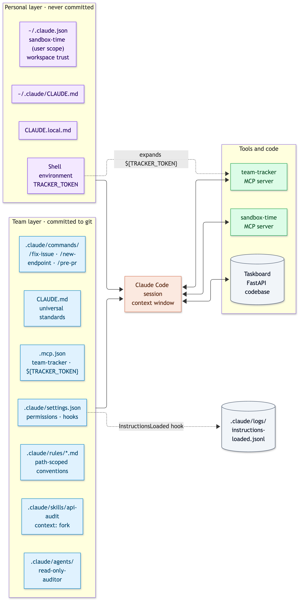

<details>
<summary>Diagram source (Mermaid)</summary>

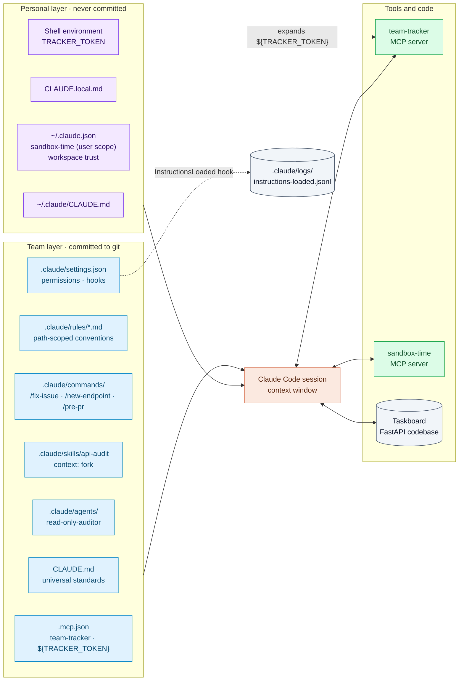

</details>

| Piece | File | Shared? | Loaded or used when |
|---|---|---|---|
| Project instructions | `CLAUDE.md` | Yes | Every session start |
| Personal project notes | `CLAUDE.local.md` | No (git-ignored) | Every session start, after `CLAUDE.md` |
| Folder instructions | `src/team_tracker/CLAUDE.md` | Yes | When Claude first works in that folder |
| Area conventions | `.claude/rules/*.md` | Yes | When Claude touches a file matching `paths:` |
| Team commands | `.claude/commands/*.md` | Yes | When a developer types `/name` |
| Forked skill | `.claude/skills/api-audit/SKILL.md` | Yes | On `/api-audit`, or when Claude decides an audit fits |
| Subagent | `.claude/agents/read-only-auditor.md` | Yes | As the fork target of `/api-audit` |
| Team settings | `.claude/settings.json` | Yes | Every session, **once the folder is trusted** |
| Personal settings | `.claude/settings.local.json` | No (git-ignored) | Every session; overrides team settings |
| Team MCP servers | `.mcp.json` | Yes | Session start, after trust and approval |
| Personal MCP servers | `~/.claude.json` (user scope) | No | Session start, in every project |

The codebase itself is **Taskboard**, a small FastAPI service with a strict layering
(`api` → `services` → `storage`). Its tracker holds three open issues of increasing complexity,
chosen to put plan mode to the test: a one-line pagination bug (TB-101), a Pydantic v1→v2 migration
across six files (TB-102), and a rate-limiting feature with four open design questions (TB-103).

---

## 2. The instruction hierarchy

Claude Code layers instruction files from broad to specific. They are all concatenated into
context, so more specific files add to broader ones rather than replacing them.

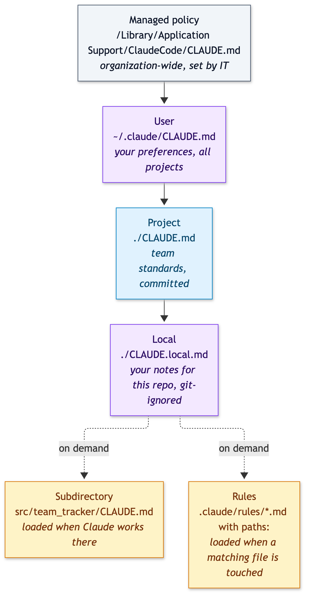

<details>
<summary>Diagram source (Mermaid)</summary>

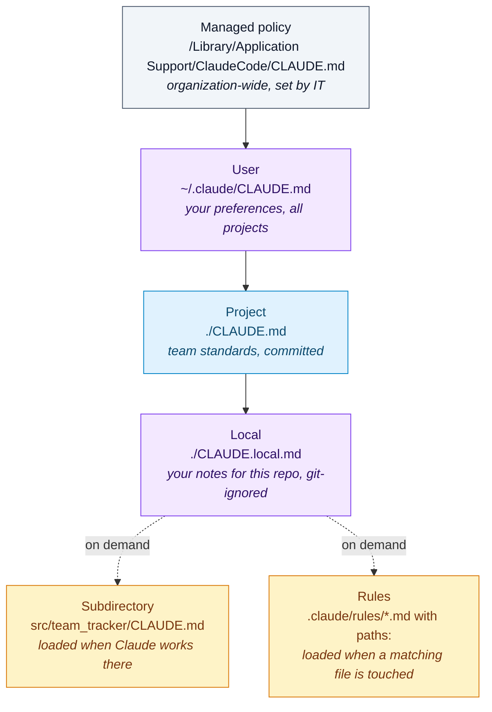

</details>

**What goes where in this repo:**

| Put it in | When | Example here |
|---|---|---|
| `CLAUDE.md` | Everyone needs it in every session | Commands, layering, the xfail convention, when to plan, commit format |
| `.claude/rules/<area>.md` | It only matters for part of the code | "DELETE returns 204 with no body" (API files only) |
| `src/<folder>/CLAUDE.md` | It only matters inside one folder | Tool-description style for the MCP server |
| `CLAUDE.local.md` | It's about *you*, not the project | "In my checkout, never run a bare `uv sync`" |

`CLAUDE.md` is kept to 56 lines. Everything area-specific moved out to rules, so it costs no
context until it's needed.

---

## 3. Path-scoped rules

Each rule file starts with YAML frontmatter listing the files it governs:

```markdown
---
paths:
  - "src/taskboard/api/**/*.py"
---

# API conventions
- Every endpoint declares `response_model` and `status_code` explicitly. ...
```

| Rule | `paths:` | Governs |
|---|---|---|
| `api-conventions.md` | `src/taskboard/api/**/*.py` | Routers, status codes, the error envelope, thin handlers |
| `testing-conventions.md` | `tests/**/*.py`, `**/test_*.py`, `**/conftest.py` | Fixtures, arrange/act/assert, asserting error codes, no sleeps |
| `domain-models.md` | `src/taskboard/models.py`, `src/taskboard/services/**/*.py`, `src/taskboard/storage/**/*.py` | Pydantic v2 idioms, status transitions, UTC timestamps |

> The brief's examples, `src/api/**/*` and `**/*.test.*`, are JavaScript-style layouts. This is
> a Python codebase, so the same ideas are expressed as `src/taskboard/api/**/*.py` and
> `**/test_*.py`.

What happens in a session, as recorded by the `InstructionsLoaded` hook:

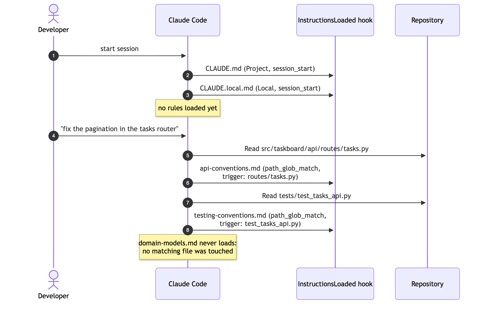

<details>
<summary>Diagram source (Mermaid)</summary>

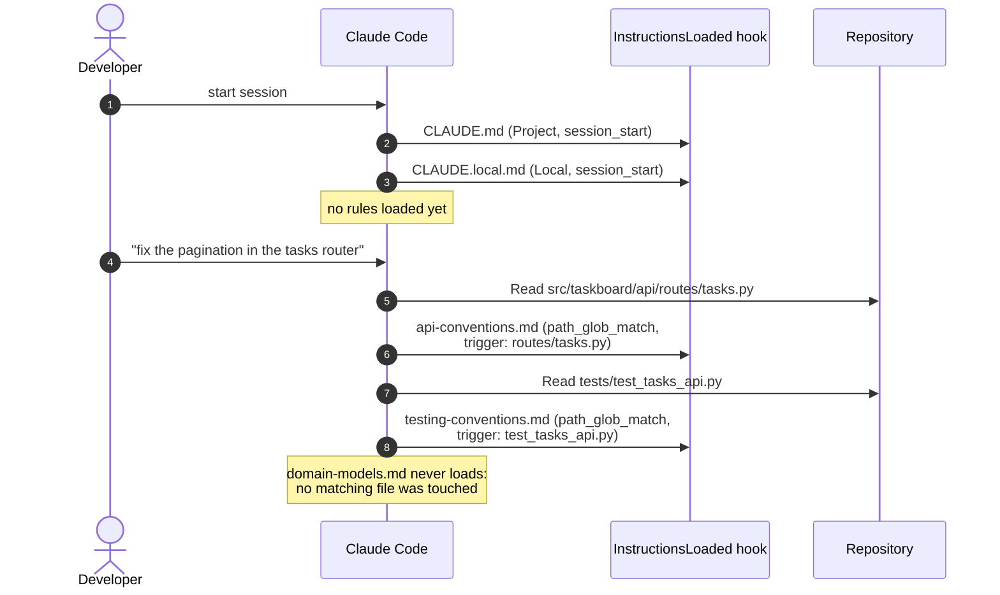

</details>

**Measured** (2026-09-29, five separate headless sessions, each reading one file):

| File read | Rules loaded | Other lazy loads |
|---|---|---|
| `src/taskboard/api/routes/tasks.py` | `api-conventions.md` only | |
| `tests/test_models.py` | `testing-conventions.md` only | |
| `src/taskboard/models.py` | `domain-models.md` only | |
| `README.md` | none | |
| `src/team_tracker/server.py` | none | `src/team_tracker/CLAUDE.md` (`nested_traversal`) |

`uv run check-claude-config rules-for <file>` predicts the same thing offline, and flags any
glob that matches no file (a rule that silently never loads).

---

## 4. Slash commands and the forked skill

| Command | Kind | Runs in | Tools pre-approved | Purpose |
|---|---|---|---|---|
| `/fix-issue <TB-###>` | Command | Main conversation | `get_issue`, `uv run pytest` | Read the issue, **size it**, reproduce, fix, verify |
| `/new-endpoint <METHOD> <path> <what>` | Command | Main conversation | `uv run pytest` | Scaffold service → route → tests in the team's layering |
| `/pre-pr` | Command | Main conversation | `git status/diff`, `pytest`, `ruff` | Inject the diff with `` !`git diff --stat` `` and check it against the team checklist |
| `/api-audit [dir]` | **Skill** | **Forked subagent** | `Read`, `Grep`, `Glob` | Audit the API layer against the API rule; return only a findings table |

The commands run inline because their output *is* the work you want to see. The audit is
different: it reads a dozen files to produce ten lines of findings, so it runs in a fork:

```yaml
---
name: api-audit
context: fork                 # run in a separate subagent context
agent: read-only-auditor      # which subagent; its `tools:` list is the real restriction
allowed-tools: Read, Grep, Glob
---
```

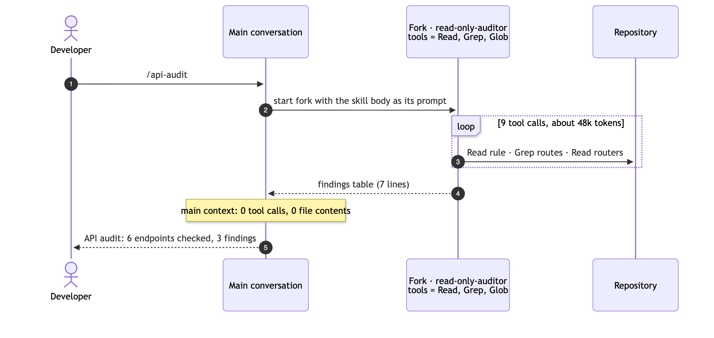

<details>
<summary>Diagram source (Mermaid)</summary>

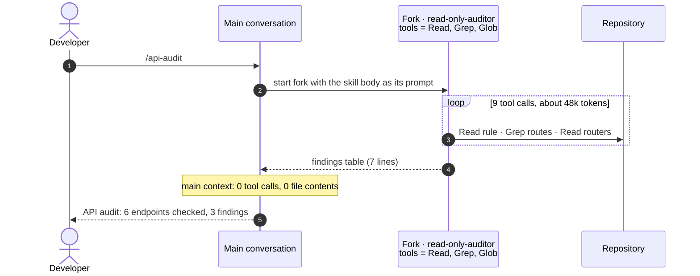

</details>

Two convention violations are planted in `src/taskboard/api/routes/tasks.py`: a `GET` that
returns `{"detail": ...}` instead of the error envelope, and a `DELETE` that answers 200 with a
body. The audit finds both on every run.

> **`allowed-tools` pre-approves; the agent restricts.** With `agent: Explore`, the fork still
> ran `Bash(find ...)`, even though `allowed-tools` listed only `Read, Grep, Glob`. Pointing the
> fork at `.claude/agents/read-only-auditor.md`, whose frontmatter says `tools: Read, Grep, Glob`,
> made the restriction real: the next run used exactly those three tools. `check-claude-config`
> now warns when a forked skill targets a built-in agent.

---

## 5. MCP servers: shared and personal

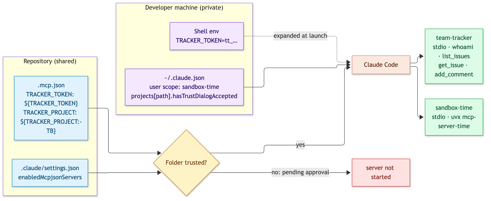

<details>
<summary>Diagram source (Mermaid)</summary>

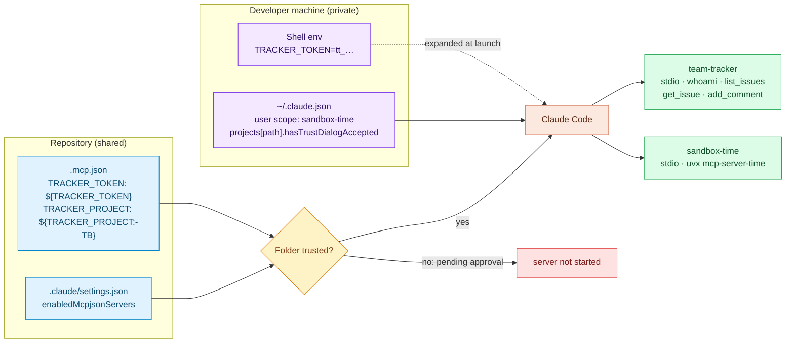

</details>

| | `team-tracker` | `sandbox-time` |
|---|---|---|
| Scope | Project (`.mcp.json`, committed) | User (`~/.claude.json`, private) |
| Who gets it | Everyone who clones and trusts the repo | Only you, in every project |
| Credentials | `${TRACKER_TOKEN}` from your shell; never in git | None |
| Added with | Editing `.mcp.json` | `scripts/personal-mcp.sh add` (`claude mcp add --scope user ...`) |
| Verified | `claude mcp list` → `✔ Connected`; `whoami` returns the masked fingerprint of your token | `claude mcp list` → `✔ Connected`, in the same listing |

**The tracker's tools** follow the conventions from the first project: descriptions that say
when to use each tool and name the overlapping one (`list_issues` points to `get_issue` for
detail), read-only annotations on reads, and `idempotentHint: false` on `add_comment`, which the
team settings put under `ask`. Credential problems come back as actionable tool errors
(`UNAUTHORIZED: TRACKER_TOKEN arrived unexpanded as '${TRACKER_TOKEN}' ...`), and `whoami` never
echoes the token.

---

## 6. Plan mode versus direct execution

The three seeded issues span the brief's three kinds of task. Each ran through Claude Code
(Sonnet) in a disposable copy of the repo, with a single prompt: *"Resolve tracker issue TB-10x.
Read it first with the team-tracker get_issue tool."*

- **direct:** edits auto-accepted, team rules in force.
- **direct, forced:** the same, plus *"do not stop to ask or to recommend plan mode"*.
- **plan → execute:** plan mode first, then the same session resumed with *"The plan is approved.
  Implement it now."*

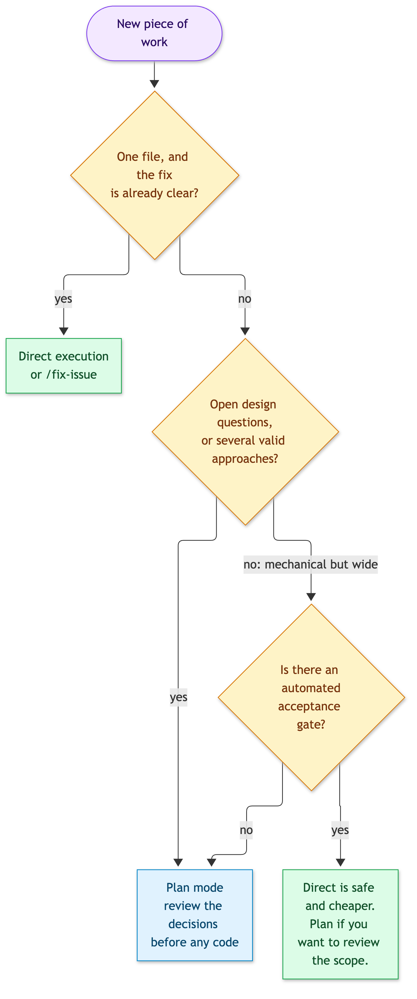

<details>
<summary>Diagram source (Mermaid)</summary>

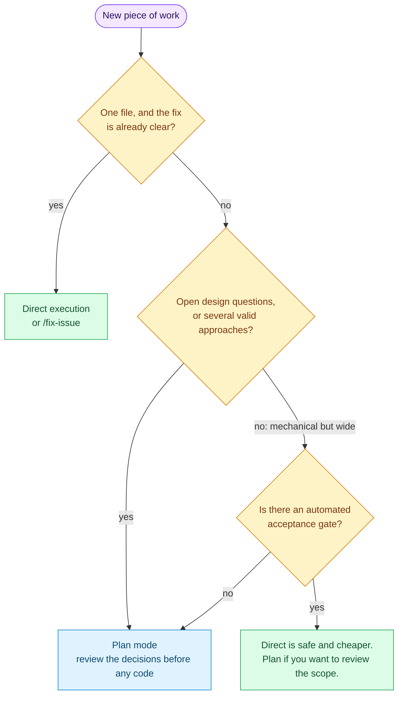

</details>

**Results** (2026-09-29, Claude Code 2.1.274, `--model sonnet`):

| Issue | Mode | Outcome | Turns | Time | Cost | Files | Tests after |
|---|---|---|---|---|---|---|---|
| **TB-101** one-line pagination bug | direct | Fixed: `(page - 1) * page_size`, xfail removed | 15 | 46 s | $0.26 | 2 | 65 pass |
| | plan → execute | Same fix, same two files | 19 | 141 s | $0.55 | 2 | 65 pass |
| **TB-102** Pydantic v1→v2 migration | direct | **Stopped**: cited the team rule and recommended plan mode | 7 | 27 s | $0.14 | 0 | unchanged |
| | direct, forced | Migrated; clean under `-W error::DeprecationWarning` | 27 | 122 s | $0.46 | 6 | 65 pass |
| | plan → execute | Migrated; clean under `-W error::DeprecationWarning` | 27 | 244 s | $0.93 | 6 | 65 pass |
| **TB-103** rate limiting, 4 open questions | direct | **Stopped**: proposed answers to the 4 questions and asked for confirmation | 5 | 33 s | $0.13 | 0 | unchanged |
| | direct, forced | Built; decisions made silently, reported afterwards; added a speculative `Protocol` | 28 | 201 s | $0.63 | 6 | 72 pass (+8) |
| | plan → execute | Built; all 4 decisions argued in the plan **before** any code; rejected the extra abstraction | 34 | 369 s | $1.30 | 6 | 76 pass (+12) |

**When plan mode provided value:**

1. **Single-file bug: none.** Both modes made the identical one-line fix. Planning cost 2.1× the
   money and 3× the time. For a precise, local problem, go direct (or use `/fix-issue`).
2. **Mechanical migration: a review checkpoint, not better code.** The forced direct run and the
   planned run changed the same six files, and both passed the strict acceptance gate. The code
   was equivalent; the direct version was, if anything, slightly more robust. Plan mode bought a
   line-by-line inventory of every v1 usage that a human could approve before six files changed,
   at 2× the cost. With an automated gate like `test_migration_readiness.py`, that's optional.
   Without one, it's cheap insurance.
3. **Feature with open questions: the most value.** Both runs reached similar answers
   (fixed window, a FastAPI dependency, `X-Client-Id` falling back to IP). The plan put each
   decision and its reasoning in front of a reviewer before any code existed. It explicitly
   rejected a Redis-ready abstraction as speculative, and it produced 50% more tests. The forced
   direct run made the same calls silently and added the abstraction anyway. Changing a decision
   there means reworking code that's already written.
4. **The team rule is a cheap triage step.** Without being forced, direct runs on TB-102 and
   TB-103 stopped in about 30 seconds for about $0.13 and explained why they needed a plan. For
   TB-103 the explanation *was* a mini-plan. Measured against the forced run, the TB-102 stop
   was more conservative than necessary, so the rule could exempt mechanical changes that have an
   automated acceptance gate.

The full plans, final replies, and how to reproduce each trial are in
[PLAYBOOK.md](PLAYBOOK.md#check-5-plan-mode-versus-direct-execution).

---

## 7. Guardrails and observability

`.claude/settings.json` (shared) carries the team's permissions and one hook:

| Setting | Value | Why |
|---|---|---|
| `permissions.allow` | `uv run pytest`, `uv run ruff`, `git status/diff/log`, read-only tracker tools | The everyday loop runs without prompts |
| `permissions.ask` | `mcp__team-tracker__add_comment` | Writes to a shared system need a human yes |
| `permissions.deny` | `Read(./.env)`, `Read(./.env.local)` | Secrets never enter the context |
| `enabledMcpjsonServers` | `["team-tracker"]` | Approves the team server, once the folder is trusted |
| `hooks.InstructionsLoaded` | `.claude/hooks/log_instructions_loaded.py` | One JSON line per loaded instruction file: what, why, and which file triggered it |

The hook is what turns "rules load lazily" from a claim into a measurement. It is standard
library only and Python 3.8 compatible (hooks run on each developer's system `python3`, which is
3.9 on stock macOS), and it swallows every error so it can never break a session.

---

## What live verification uncovered

Building this against the real CLI (Claude Code 2.1.274) turned up six behaviours that aren't
obvious from the docs. Each is now handled in the design and written down here.

| # | Observation | Consequence in this repo |
|---|---|---|
| 1 | **Workspace trust gates the team layer.** In an untrusted folder, Claude Code reads `CLAUDE.md` but ignores the project's `permissions`, hooks, and MCP approvals ("Ignoring 9 permissions.allow entries ..."). | Getting started says: run `claude` once and accept the trust dialog. |
| 2 | **A repo can't approve its own MCP servers before trust.** `enabledMcpjsonServers` in the committed settings had no effect until the folder was trusted; afterwards it approved `team-tracker` on its own. | Kept in `settings.json`; documented as trust-dependent. |
| 3 | **An unset `${VAR}` is a warning, not a failure.** `claude mcp list` prints `Missing environment variables: TRACKER_TOKEN` and still starts the server. | The server detects an unexpanded `${TRACKER_TOKEN}` and says exactly how to fix it. |
| 4 | **`allowed-tools` pre-approves; it doesn't restrict.** A fork into `Explore` used `Bash` despite `allowed-tools: Read, Grep, Glob`. | The skill forks into a custom agent whose `tools:` list is the allowlist; the linter warns on built-in fork targets. |
| 5 | **Hooks run on the system `python3`.** Here that was 3.9, so a hook using `datetime.UTC` (3.11+) would crash. | The hook targets Python 3.8, and ruff's pyupgrade rules are disabled for `.claude/hooks/`. |
| 6 | **A clear rule in `CLAUDE.md` changes Claude's behaviour.** Asked to resolve TB-102 and TB-103 directly, Claude stopped and recommended plan mode, as the team rule says. | The rule works as a brake. The trials also measure forced direct runs to see what the brake is worth. |

---

## Getting started

Requirements: Python 3.12+, [uv](https://docs.astral.sh/uv/), and the
[Claude Code CLI](https://code.claude.com/docs) (signed in).

```bash
uv sync                              # create .venv and install dependencies
cp .env.example .env                 # the demo tracker accepts the placeholder token
set -a; source .env; set +a          # Claude Code expands ${TRACKER_TOKEN} from the shell, not from .env
uv run pytest                        # 64 offline tests, no Claude account needed
uv run check-claude-config           # lint the Claude Code setup
claude                               # first run: accept the trust dialog
```

Optional:

```bash
cp CLAUDE.local.md.example CLAUDE.local.md   # personal instructions, git-ignored
scripts/personal-mcp.sh add                  # personal experimental MCP server (user scope)
```

| Variable | Default | Purpose |
|---|---|---|
| `TRACKER_TOKEN` | none (required) | Credential for the `team-tracker` MCP server, expanded into `.mcp.json` |
| `TRACKER_PROJECT` | `TB` | Issue key prefix, via `${TRACKER_PROJECT:-TB}` |
| `TASKBOARD_PORT` | `8000` | Port for `uv run taskboard-api` |
| `CLAUDE_LIVE_MODEL` | `haiku` | Model used by `pytest -m live` |

---

## Usage

**Work on an issue:**

```text
> /fix-issue TB-101            # small bug: fixed test-first, commit message drafted
> /fix-issue TB-102            # migration: stops and recommends plan mode
> (Shift+Tab to plan mode) Resolve TB-103.
```

**Audit, scaffold, and check before a PR:**

```text
> /api-audit                                   # forked, read-only findings table
> /new-endpoint POST /v1/tasks/{id}/comments add a comment to a task
> /pre-pr                                      # PASS/FAIL against the team checklist
```

**Inspect the setup:**

```bash
uv run check-claude-config                                  # full lint
uv run check-claude-config rules-for src/taskboard/models.py # which rules would load
uv run check-claude-config mcp-env                          # which ${VARS} are set
claude mcp list                                             # both MCP scopes, live
```

**Run the API:** `uv run taskboard-api`, then open http://127.0.0.1:8000/docs.

---

## Testing and verification

Three layers, each answering a different question.

### Offline tests: `uv run pytest`

64 fast, deterministic tests. No Claude account needed.

| File | What it proves |
|---|---|
| `test_claude_config.py` | This repo's configuration lints clean. Every file maps to exactly the right rules. Rules are path-scoped. The skill forks into a read-only agent. `.mcp.json` holds only `${VAR}` references. Personal files are git-ignored. Glob semantics are right. Broken configs are caught: a literal token, a defaulted secret, a write-capable fork, a built-in fork agent, a dead glob, an unscoped rule, an unignored `CLAUDE.local.md`, an unknown approved server. |
| `test_team_tracker.py` | Missing, unexpanded, and malformed tokens are explained and block every call. `whoami` masks the token. Issue IDs follow the project key. Over a real stdio MCP session: tools list with annotations, and calls work with a token and fail with `UNAUTHORIZED` without one. |
| `test_instructions_hook.py` | The hook writes one relative-path record per event and never fails a session on bad input. |
| `test_tasks_api.py`, `test_models.py` | The Taskboard API and models behave as specified. TB-101 is pinned with a strict `xfail`. |
| `test_migration_readiness.py` | TB-102's acceptance gate: the app runs with `-W error::DeprecationWarning`. Strict `xfail` until migrated. |

### Live tests: `uv run pytest -m live`

9 tests that drive the real `claude` CLI headlessly and check what it loaded and called (via the
hook log, stream-json events, and subagent transcripts). About 100 seconds on Haiku, a few cents.

| Test | Passes when |
|---|---|
| `test_project_instructions_load_at_start_and_rules_do_not` | `CLAUDE.md` loads at `session_start` as `Project`, and no rule does |
| `test_path_scoped_rule_loads_only_for_matching_file` ×4 | Reading each file loads exactly its rule; `README.md` loads none |
| `test_subdirectory_claude_md_loads_when_its_folder_is_touched` | `src/team_tracker/CLAUDE.md` loads on first touch of that folder |
| `test_project_mcp_server_receives_token_from_environment` | A random per-run token's last 4 characters come back from `whoami` |
| `test_forked_skill_runs_in_isolation_with_read_only_tools` | Main conversation: 0 tool calls. Fork: only `Read`/`Grep`/`Glob`. The report cites `tasks.py`. |
| `test_project_and_personal_mcp_servers_are_both_available` | `team-tracker` and `sandbox-time` are both `Connected` |

Result on 2026-09-29: **9/9 passed**.

### Plan-mode trials: `scripts/plan_vs_direct.py`

Each trial runs one issue in a disposable copy of the repo and prints a JSON summary: turns,
cost, time, files changed, and test results. See [section 6](#6-plan-mode-versus-direct-execution)
for results and [PLAYBOOK.md](PLAYBOOK.md#check-5-plan-mode-versus-direct-execution) for the full
walk-through.

---

## How each requirement is met

| Requirement ([PROJECT.md](PROJECT.md)) | Where it is implemented | How it is verified |
|---|---|---|
| Project-level `CLAUDE.md` with universal coding standards and testing conventions, applied consistently for every team member | `CLAUDE.md` (committed); `CLAUDE.local.md` git-ignored; linter guards both | Live: loaded at `session_start` in every session and in a fresh untrusted clone; offline: `test_repository_configuration_has_no_errors_or_warnings` |
| `.claude/rules/` with YAML `paths:` globs per code area; rules load only for matching files | `api-conventions.md`, `testing-conventions.md`, `domain-models.md` | Live: `test_path_scoped_rule_loads_only_for_matching_file` (4 cases); offline: `test_each_file_loads_only_its_own_rules` (8 cases) |
| Project skill with `context: fork` and `allowed-tools`, isolated from the main context | `.claude/skills/api-audit/`, `.claude/agents/read-only-auditor.md` | Live: `test_forked_skill_runs_in_isolation_with_read_only_tools` |
| MCP server in `.mcp.json` with env var expansion; a personal server in `~/.claude.json`; both available | `.mcp.json`, `src/team_tracker/`, `scripts/personal-mcp.sh` | Live: `test_project_mcp_server_receives_token_from_environment`, `test_project_and_personal_mcp_servers_are_both_available` |
| Plan mode vs direct execution on a bug fix, a migration, and a feature | TB-101/102/103 in the tracker; `scripts/plan_vs_direct.py` | 8 measured trials ([section 6](#6-plan-mode-versus-direct-execution)) |
| Custom slash commands for the team workflow | `.claude/commands/fix-issue.md`, `new-endpoint.md`, `pre-pr.md` | Linted; `/fix-issue TB-102` sizing gate observed live |
| Design first, in Mermaid, as the README front page | Sections 1-7 of this README | |

---

## Design decisions and trade-offs

- **A real codebase, not config in a vacuum.** Rules, commands, and plan mode only mean
  something against code with real conventions and real problems. Taskboard is small enough to
  read in minutes, and it's seeded with a bug, a migration, and a design problem.
- **Known bugs pinned with strict `xfail`.** The suite is green on a fresh clone, yet each seeded
  issue has an executable acceptance test. When a fix lands, the strict flag fails the suite
  until the marker is removed, so "done" is checkable by a machine.
- **`CLAUDE.md` stays universal; rules carry the detail.** Anything that applies to one area
  lives in a path-scoped rule. The team file stays at 56 lines and every session pays only for
  what it touches.
- **Commands for inline work, a skill for isolated work.** `/fix-issue` and friends run in the
  main conversation because you want to watch them. `/api-audit` reads a lot to say a little,
  so it forks.
- **The restriction lives in the agent.** `allowed-tools` alone doesn't stop a fork from using
  other tools (observed live). A dedicated `read-only-auditor` agent does, and the linter
  enforces the pattern.
- **Credentials are required, never defaulted.** `${TRACKER_TOKEN}` has no fallback, and the
  linter rejects a secret with a `:-default`. Non-secrets like `${TRACKER_PROJECT:-TB}` do get
  defaults, so a missing optional variable never blocks anyone.
- **The server tolerates a missing token.** It starts anyway and answers with a precise
  `UNAUTHORIZED` error. A server that refuses to start is harder to diagnose from inside a
  session than one that says what's wrong.
- **A brake in `CLAUDE.md`, plus a sizing step in `/fix-issue`.** Plan mode is a human decision,
  but the team rule makes Claude stop and recommend it for large or open-ended work. The trials
  show when that brake saves real risk and when it only adds cost.
- **Observability as a hook.** The `InstructionsLoaded` log costs nothing when you ignore it
  and gives hard evidence when you need to debug why a rule did or didn't apply.
- **A linter for the setup.** Claude Code configs fail silently: a glob with a typo simply never
  loads. `check-claude-config` turns those silent failures into CI errors.

---

## Project structure

```text
.
├── README.md                     design and documentation (this file)
├── PROJECT.md                    project brief: objective and tasks
├── PLAYBOOK.md                   hands-on verification guide with sample runs
├── CLAUDE.md                     team instructions (committed)
├── CLAUDE.local.md.example       template for personal instructions (git-ignored copy)
├── .mcp.json                     team MCP server, credentials via ${TRACKER_TOKEN}
├── .env.example                  configuration template
├── .claude/
│   ├── settings.json             team permissions, MCP approval, InstructionsLoaded hook
│   ├── rules/                    path-scoped conventions: api, testing, domain models
│   ├── commands/                 /fix-issue, /new-endpoint, /pre-pr
│   ├── skills/api-audit/         forked, read-only audit skill
│   ├── agents/                   read-only-auditor subagent (the fork target)
│   └── hooks/                    log_instructions_loaded.py
├── src/
│   ├── taskboard/                the FastAPI service Claude works on
│   │   ├── api/                  routers, dependencies, error envelope
│   │   ├── services/             business rules (TB-101 lives here)
│   │   ├── storage/              in-memory repository
│   │   └── models.py             Pydantic models (TB-102 starts here)
│   ├── team_tracker/             MCP server for the issue tracker (+ its own CLAUDE.md)
│   └── claude_config_check/      the check-claude-config linter
├── docs/diagrams/                PNG renders of every Mermaid diagram (for the GitHub mobile app)
├── scripts/
│   ├── personal-mcp.sh           add/remove the user-scope sandbox-time server
│   ├── plan_vs_direct.py         run an issue in plan or direct mode and measure it
│   └── render_diagrams.py        re-render docs/diagrams/ after editing a Mermaid block
└── tests/                        offline tests and the live Claude Code suite
```
